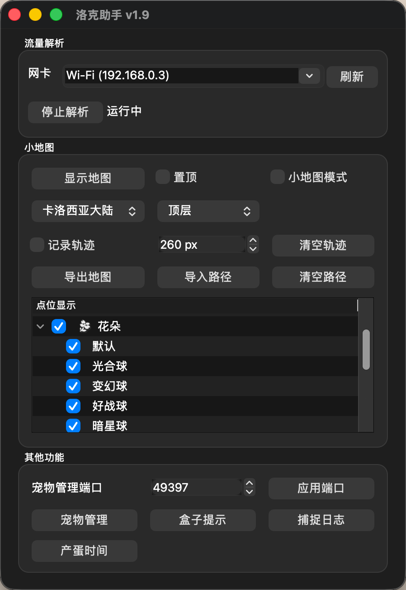

# 洛克王国世界助手

基于网络流量解析实现的《洛克王国：世界》辅助工具。支持宠物全维度筛选（自动导入）、精灵图鉴（任务状态同步、任务筛选）、孵蛋覆盖表、S2 盒子属性显示、异色提示等功能。

工具不读取游戏内存、不注入游戏进程，更不会修改游戏数据；它只解析游戏客户端与服务器之间的 TCP 流量，并通过本地 Web 页面展示数据。

> [!CAUTION]
> Windows 游戏端直接运行工具可能存在封号风险，请自行评估并承担风险。
>
> **推荐顺序：软路由 Docker 网卡抓包 > NAS/其他网关设备网卡抓包 > 手机流量经电脑转发 > SOCKS5 > Windows 直接运行。**
>
> SOCKS5、Reqable 方案只能让游戏检测不到工具进程、降低直接运行带来的风险，不能保证不会封号。
> 
> 软路由/NAS Docker 部署 + 网卡抓包 + 1设备玩游戏、1设备查看网页的方式理论上安全

> [!IMPORTANT]
> 请先启动工具和流量解析，再点击游戏中的 `进入世界`。如果进入世界后才启动，请退出到登录界面后重新进入或者断网重连，确保工具能取得完整会话和解密所需信息。

> [!NOTE]
> 本项目只提供 PVE、宠物筛选、图鉴相关功能，不提供 PVP 相关或其他影响游戏平衡的功能。

## 交流群

遇到文档未覆盖的问题，可加入 QQ 群 `939403587` 讨论。反馈时请说明系统、部署方式、工具版本，并附上问题发生时间附近的日志。

## 第三方项目/插件

- [洛克捕手（zhuweitung/roco-catcher）](https://github.com/zhuweitung/roco-catcher)：基于洛克助手 API 开发的 Android 应用，可统计精灵捕捉数量、速率、任务进度及后台通知。

## 目录

- [快速选择：我应该用哪种方式](#快速选择我应该用哪种方式)
- [工作原理与默认端口](#工作原理与默认端口)
- [下载](#下载)
- [Docker 部署](#docker-部署推荐)
- [Windows 使用](#windows-使用)
- [macOS 使用](#macos-使用)
- [配置 Proxifier](#使用-proxifier-将游戏流量转入-socks5)
- [配置 Clash](#使用-clash-将游戏流量转入-socks5)
- [手机热点与 Reqable](#手机玩游戏电脑负责解析)
- [确认是否正常工作](#确认是否正常工作)
- [常见问题](#常见问题排查)
- [Linux CLI 与环境变量](#linux-cli-与环境变量)
- [功能介绍](#功能介绍)

## 快速选择：我应该用哪种方式

| 使用场景 | 推荐方式 | 说明                                          |
| --- | --- |---------------------------------------------|
| 有软路由 | Docker 网卡抓包 | 首选方案。软路由作为游戏设备网关，可直接观察经过的游戏流量 |
| 有 NAS | Docker 网卡抓包；不满足条件时使用 SOCKS5 | 网卡抓包要求游戏流量实际经过 NAS，仅处于同一局域网并不够 |
| Windows 玩游戏，无软路由/NAS | Windows 工具 + 网卡抓包 | 配置简单，但工具与游戏运行在同一台电脑，存在风险 |
| macOS 通过 PlayCover 玩游戏 | macOS 工具 + 网卡抓包 | 需要安装 Wireshark 的 ChmodBPF；PlayCover 游戏进程名为 `com.tencent.nrc` |
| 手机玩游戏 | 软路由网卡抓包 / 电脑热点 / Reqable | 让手机流量经过运行工具的设备，再由工具解析 |

两种部署方式的区别：

- **网卡抓包（pcap，推荐）**：工具被动监听指定网卡上的 TCP 8195 流量，无需修改游戏网络或配置代理。只要所选网卡能够看到游戏流量，即可直接使用。
- **Docker microsocks（备选）**：Docker 镜像先启动 microsocks，再让 roco_helper 通过 pcap 抓取容器 `eth0` 上的代理流量。适合宿主机不在游戏流量路径上的环境，需要额外配置 Proxifier、Clash 等转发规则。

## 工作原理与默认端口

roco_helper 监听 `tcp port 8195` 并进行 TCP 流重组。Docker SOCKS5 部署中的代理转发由独立的 microsocks 进程负责，roco_helper 只抓取该进程在容器网卡上产生的流量。完整流量随后经过 TGCP 分包、解密和 Protobuf 解析，结果保存在数据目录中并通过内置 Web 服务提供界面。

| 用途 | 默认值 | 说明 |
| --- | --- | --- |
| 游戏目标端口 | `8195/TCP` | 工具固定解析的游戏流量端口 |
| Web 服务 | `4939/TCP` | 浏览器访问工具界面 |
| microsocks 服务 | `1080/TCP` | 仅 Docker SOCKS5 部署需要 |
| 桌面端 Web 绑定地址 | `127.0.0.1` | 只允许本机访问；需要供局域网访问时改为 `0.0.0.0` |

> [!WARNING]
> Docker 镜像中的 microsocks 不需要用户名和密码。不要将 `1080` 端口映射到公网；只应在可信局域网内使用，并通过路由器或系统防火墙限制来源。

## 下载

- Docker Compose：[网卡抓包版](docker-compose.yml) | [SOCKS5 版](docker-compose-socks5.yml)
- Windows：[下载最新版本](https://github.com/h3110w0r1d-y/rocom-helper/releases/latest)
- macOS：[下载最新版本](https://github.com/h3110w0r1d-y/rocom-helper/releases/latest)

Docker 镜像为 `h3110w0r1d6/roco-helper:latest`，同时支持 `amd64` 和 `arm64`。Windows 与 macOS 下载页面中的文件名通常分别类似：

- Windows：`roco_helper-vX.X.X.exe`
- macOS：`roco_helper.app-vX.X.X.zip`

## Docker 部署（推荐）

Docker 有两种 Compose 配置，**二选一即可，不要同时启动**：

- `docker-compose.yml`：网卡抓包模式，适合软路由或能确保流量经过宿主机的环境。
- `docker-compose-socks5.yml`：容器内 microsocks + pcap，适合无法让游戏流量经过 Docker 宿主机网卡的环境。

两种配置都将容器 `/data` 映射到 Compose 文件同目录的 `./data`，数据库和日志会保存在这里。升级或重建容器不会清空该目录，但仍建议定期备份。

### 方案一：Docker 网卡抓包

此方案使用 [docker-compose.yml](docker-compose.yml)，容器采用宿主机网络，并申请 `NET_RAW`、`NET_ADMIN` 能力。

#### 适用条件

- 软路由本身是游戏设备的网关，能够看到游戏连接；
- NAS 被配置为游戏设备的网关、透明网桥、旁路由，并且游戏流量确实从 NAS 的目标网卡经过。

**NAS 与游戏设备仅连接在同一个交换机或 Wi-Fi 下时，NAS 通常看不到两台其他设备之间的单播流量，直接抓包不会生效。** 在 NAS 上使用此方案往往还需要改默认网关、策略路由或网络拓扑；不熟悉网络配置时请使用 SOCKS5 方案。

#### 配置步骤

1. 将 [docker-compose.yml](docker-compose.yml) 保存到一个独立目录。
2. 确认承载游戏流量的宿主机网卡：

   ```shell
   ip -br addr
   ip route
   ```

   常见名称可能是 `eth0`、`br-lan`、`br0`，请以实际环境为准。软路由通常应选择能看到 LAN 客户端流量的桥接接口，而不是照抄示例。

3. 编辑 Compose 文件中的 `ROCO_IFACE=eth0`，替换为上一步确认的网卡名。
4. 启动服务：

   ```shell
   docker compose -f docker-compose.yml up -d
   ```

5. 查看启动日志：

   ```shell
   docker compose -f docker-compose.yml logs -f
   ```

6. 在同一局域网的浏览器访问：

   ```text
   http://软路由或NAS的局域网IP:4939
   ```

7. 保持工具运行，再进入游戏。

### 方案二：Docker SOCKS5

此方案使用 [docker-compose-socks5.yml](docker-compose-socks5.yml)，会发布以下端口：

- `4939`：Web 界面
- `1080`：SOCKS5 服务

#### 配置步骤

1. 将 [docker-compose-socks5.yml](docker-compose-socks5.yml) 保存到一个独立目录。
2. 启动服务：

   ```shell
   docker compose -f docker-compose-socks5.yml up -d
   ```

3. 查看启动日志：

   ```shell
   docker compose -f docker-compose-socks5.yml logs -f
   ```

4. 浏览器打开 `http://设备局域网IP:4939`。
5. 使用 Proxifier 或 Clash，将游戏进程访问目标端口 `8195` 的连接转到 SOCKS5。Windows 游戏进程名为 `nrc-win64-shipping.exe`，macOS PlayCover 进程名为 `com.tencent.nrc`：

   ```text
   SOCKS5 地址：软路由或 NAS 的局域网 IP
   SOCKS5 端口：1080
   用户名/密码：无
   ```

6. 确认代理规则生效后，再进入游戏世界。

如果 Docker 宿主机启用了防火墙，需要允许游戏电脑访问 TCP `1080` 和 `4939`。无需也不应在公网路由器上做端口转发。

### Docker 常用操作

```shell
# 查看容器状态
docker compose ps

# 查看最近 200 行日志
docker compose logs --tail=200 roco-helper

# 拉取新镜像并重建
docker compose pull
docker compose up -d

# 停止并删除容器（不会删除 ./data）
docker compose down
```

如果 Compose 文件名不是默认的 `compose.yml` 或 `docker-compose.yml`，以上命令需要加上 `-f 文件名`。

## Windows 使用

### 安装 Npcap

Windows 的网卡抓包模式依赖 [Npcap](https://npcap.com/#download)。安装时请勾选：

```text
Install Npcap in WinPcap API-compatible Mode
```

安装或重新安装后建议重启工具；仍无法看到网卡时可重启 Windows。

### 网卡抓包

1. 启动 `roco_helper-vX.X.X.exe`。
2. 选择游戏实际使用的网卡，例如正在联网的以太网或 Wi-Fi。不要仅凭名称选择虚拟网卡；不确定时可根据界面显示的 IP 地址判断。
3. 点击“开启解析”。桌面端会记住上次选择的网卡，正常情况下启动后也会自动尝试开启解析。
4. 点击“打开 Web 界面”，确认页面能打开。
5. 最后启动游戏点击 `进入世界`。

## macOS 使用

### 安装抓包权限组件

macOS 的网卡抓包模式需要安装 Wireshark 提供的 `ChmodBPF.pkg`。可从 [Wireshark 官方下载页](https://www.wireshark.org/download.html) 获取 macOS 安装包，并在安装器中安装 ChmodBPF 组件。安装后重新登录系统或重启，再启动工具。

如果系统提示应用已损坏、无法验证开发者，或应用被隔离，可确认文件来自本项目发布页后执行：

```shell
sudo xattr -dr com.apple.quarantine /Applications/roco_helper.app
```

如果应用不在 `/Applications`，请将命令中的路径替换为实际 `.app` 路径。执行该命令会移除 macOS 的隔离标记，只应对你确认可信的应用使用。

### 网卡抓包模式

1. 启动应用，在“流量解析”中选择承载目标流量的网卡。
2. 选择承载目标流量的 Wi-Fi、以太网或热点接口。
3. 点击“开启解析”，再打开 Web 界面。
4. 让游戏流量经过该 Mac，并在进入世界前保持解析运行。

## 使用 Proxifier 将游戏流量转入 SOCKS5

Proxifier 同时提供 Windows 和 macOS 版本，两端的配置方法基本相同。以下名称以 Proxifier 常见英文界面为例，不同版本可能略有区别。

### 1. 添加 SOCKS5 服务

进入 `Profile -> Proxy Servers -> Add`：

| 字段 | Docker 部署 |
| --- | --- |
| Address | NAS、软路由或 Docker 宿主机的局域网 IP |
| Port | `1080`，除非你修改了端口映射 |
| Protocol | `SOCKS Version 5` |
| Authentication | 不启用 |

可使用 Proxifier 的检查功能测试连通性。检查失败时先排查 IP、Docker 容器状态和防火墙，不要急着启动游戏。

### 2. 添加游戏规则

进入 `Profile -> Proxification Rules -> Add`，创建规则：

| 字段 | 值 |
| --- | --- |
| Name | `Roco World 8195` |
| Applications | `com.tencent.nrc;nrc-win64-shipping.exe` |
| Target hosts | `Any` |
| Target ports | `8195` |
| Action | 刚添加的 SOCKS5 服务 |

`Applications` 中可以用分号同时填写 macOS PlayCover 和 Windows 游戏进程名，因此同一份配置可兼容两端：

```text
com.tencent.nrc;nrc-win64-shipping.exe
```

将这条规则放在 `Default` 等宽泛规则之前。不要把所有系统流量都强制转入工具，工具只需要游戏进程访问 TCP 8195 的连接。

### 3. 验证

1. 先启动 Docker SOCKS5 部署。
2. 再启动 Proxifier 并启用规则。
3. 最后进入游戏。
4. 在 Proxifier 连接列表中确认 `com.tencent.nrc` 或 `nrc-win64-shipping.exe` 访问 `目标IP:8195` 时，Action 是配置的 SOCKS5。

## 使用 Clash 将游戏流量转入 SOCKS5

支持覆写脚本、进程规则和 `AND` 规则的 Clash 客户端，可将 Docker 部署作为一个 SOCKS5 节点注入现有订阅，并把自定义规则放在订阅规则最前面。

```javascript
const main = (config) => {
  if (!config.proxies) config.proxies = [];
  if (!config.rules) config.rules = [];

  const localSocksProxyName = 'RocoSocks5';

  // 注入 Docker 镜像中 microsocks 提供的 SOCKS5 服务。
  config.proxies.push({
    name: localSocksProxyName,
    type: 'socks5',
    server: '192.168.1.2', // 修改为 Docker 宿主机的局域网 IP
    port: 1080,
  });

  // 分别覆盖 macOS PlayCover 和 Windows 游戏进程，只代理目标端口 8195。
  const customRules = [
    `AND,((PROCESS-NAME,com.tencent.nrc),(DST-PORT,8195)),${localSocksProxyName}`,
    `AND,((PROCESS-NAME,nrc-win64-shipping.exe),(DST-PORT,8195)),${localSocksProxyName}`,
  ];

  // 必须放在已有规则之前，避免先被 MATCH、DIRECT 等规则命中。
  config.rules = [...customRules, ...config.rules];

  return config;
};
```

注意事项：

- Docker/NAS/软路由部署时，将 `server` 改为设备的局域网 IP，不能填游戏电脑自己的 `127.0.0.1`。
- macOS PlayCover 对应 `com.tencent.nrc`，Windows 客户端对应 `nrc-win64-shipping.exe`；示例同时包含两条规则，可直接兼容两端。
- Clash 客户端需要启用能识别进程名的运行方式；不同客户端可能要求 TUN 模式或管理员权限。
- 应用覆写后检查最终配置，确认 `RocoSocks5` 节点与自定义规则都存在，规则位于 `MATCH` 等兜底规则之前。
- 如果同名节点已存在，避免重复注入，可修改节点名或先删除旧配置。

## 手机玩游戏，电脑负责解析

目标是让手机的游戏流量经过运行工具的电脑，从而避免在 Windows 游戏进程旁直接运行工具。常见方式有两种。

### 电脑开热点

1. 电脑开启移动热点，并让手机连接该热点。
2. 在电脑上启动工具，选择承载热点转发流量的网卡进行抓包。
3. 先确认 Web 界面和解析已经启动，再在手机上进入世界。
4. 如果抓不到数据，检查选择的是否是热点/共享网络对应接口；不同系统和网卡驱动显示的名称不同。

### 使用 Reqable 等代理工具

也可以在电脑运行 Reqable 等代理软件，并按照该软件的局域网代理说明，让手机流量经电脑转发：

1. 手机与电脑在同一局域网。
2. 在 Reqable 中开启局域网代理服务。
3. 按 Reqable 显示的地址和端口配置手机网络代理，确保手机流量实际经过电脑。
4. 在电脑上启动本工具并选择能看到这部分转发流量的接口。
5. 先启动解析，再进入游戏世界。

这里只需要转发和观察 TCP 流量，不要安装来源不明的证书。不同系统对 Wi-Fi HTTP 代理、全局 TCP 代理的支持不同；如果游戏不遵循系统代理，应改用热点、TUN/VPN 转发或 SOCKS5 路由方案。

## 确认是否正常工作

不要只以“Web 页面能打开”判断解析正常。建议依次确认：

1. 工具状态显示“运行中”。
2. Web 页面可以访问：
   - 本机桌面端：`http://127.0.0.1:4939`
   - Docker/局域网设备：`http://设备局域网IP:4939`
3. SOCKS5 方案中，Proxifier/Clash 能看到游戏端口 8195 命中指定代理。
4. 进入世界后，宠物、地图或其他实时数据能够更新。

## 常见问题排查

### 日志在哪里

| 平台 | 默认日志位置 |
| --- | --- |
| Windows | `%APPDATA%\roco_helper\roco_helper.log`，通常是 `C:\Users\你的用户名\AppData\Roaming\roco_helper\roco_helper.log` |
| macOS | `~/Library/Application Support/roco_helper/roco_helper.log` |
| Docker | Compose 目录下的 `./data/roco_helper.log`，容器内路径为 `/data/roco_helper.log` |

Windows 可按 `Win + R`，输入 `%APPDATA%\roco_helper` 后回车。macOS 可在 Finder 中选择“前往文件夹”，输入 `~/Library/Application Support/roco_helper`。

### Web 页面打不开

- 本机桌面端先访问 `http://127.0.0.1:4939`，不要访问 `0.0.0.0`。
- 从其他设备访问时，Web 绑定地址必须是 `0.0.0.0` 或宿主机局域网 IP，并放行 TCP `4939`。
- Docker 使用设备的局域网 IP，不能在另一台设备上访问 `127.0.0.1:4939`。
- 检查 4939 端口是否被其他程序占用；必要时修改 `ROCO_PORT` 或桌面端 Web 端口。

### Docker 网卡抓包已运行，但没有数据

- `ROCO_IFACE` 可能写错。容器使用宿主机网络，填写的是宿主机接口名。
- 游戏流量没有经过该软路由/NAS。处于同一局域网不代表能被抓到。
- 先确认路由、网桥、旁路由策略，再考虑工具本身。
- 确保容器保留了 Compose 中的 `NET_RAW` 和 `NET_ADMIN`。

### SOCKS5 已启动，但工具没有数据

- 游戏能联网不代表规则已命中；在 Proxifier/Clash 中检查实际连接和规则结果。
- 规则应同时匹配游戏进程与目标端口 `8195`。macOS PlayCover 使用 `com.tencent.nrc`，Windows 使用 `nrc-win64-shipping.exe`。
- 自定义规则必须位于 `DIRECT`、`MATCH` 等兜底规则之前。
- 使用 Docker 宿主机的局域网 IP，不能填写游戏电脑自己的 `127.0.0.1`。
- roco_helper 只抓取并解析目标端口 8195；其他经过 microsocks 的连接只会被转发。

### 启用 SOCKS5 后游戏无法连接

- 检查 SOCKS5 服务是否已经启动，以及 IP、端口是否填反。
- 检查 Windows/macOS/Linux 防火墙和 Docker 的 `1080:1080` 端口映射。
- 镜像中的 microsocks 未启用认证，不要在客户端配置用户名密码。
- 先用客户端的代理检查功能测试，再启动游戏。

### Windows 看不到网卡或提示抓包权限错误

确认已安装 Npcap 并勾选 WinPcap API-compatible Mode。重新安装后重启系统，再点击“刷新”网卡。

### macOS 看不到网卡或无法抓包

确认安装了 Wireshark 的 `ChmodBPF.pkg`，重新登录或重启。应用无法启动时再检查 quarantine 隔离标记，不要把 xattr 命令当作抓包权限组件的替代品。

### 页面能打开，但进入世界后一直没有数据

- 工具可能启动得太晚。保持解析运行，退出到登录界面后重新进入世界。
- 检查游戏连接是否仍使用目标端口 8195。
- 查看日志是否提示网卡选择错误、缺少会话信息或 SOCKS5 规则未命中。

## Linux CLI 与环境变量

Linux 可执行文件仅使用网卡抓包模式。

### 网卡抓包示例

```shell
./roco_helper \
  --iface=eth0 \
  --bind=0.0.0.0 \
  --port=4939 \
  --data_dir=./data
```

### 参数与环境变量

| CLI 参数 | 环境变量 | 默认值 | 说明 |
| --- | --- | --- | --- |
| `-i, --iface` | `ROCO_IFACE` | 默认路由网卡 | pcap 监听接口 |
| `-b, --bind` | `ROCO_BIND` | `127.0.0.1` | Web 服务绑定地址 |
| `-p, --port` | `ROCO_PORT` | `4939` | Web 服务端口 |
| `-d, --data_dir` | `ROCO_DATA_DIR` | Qt 应用数据目录 | 数据库和日志目录 |

命令行参数优先于环境变量。Docker 镜像中的 microsocks 由镜像入口脚本独立启动，不属于 roco_helper 的 CLI 功能。

## 功能介绍

### 桌面端控制窗口

桌面端可以选择网卡、启动或停止解析、修改 Web 服务监听地址和端口，并打开 Web 界面。



### 宠物管理

#### 宠物筛选

支持按自定义名称、精灵名称、进化链、等级、声音、体重、性别、系别、性格、个体值、血脉、蛋组、咕噜球、天分、技能、特长、佩戴奖牌、盒子和标记等条件筛选。


#### 孵蛋覆盖


## 数据备份与隐私

- 数据库与日志保存在工具的数据目录；Docker 默认是 Compose 目录下的 `./data`。
- 日志可能包含本机网卡、连接地址、错误上下文等排障信息，公开发送前请自行检查并脱敏。
- SOCKS5 是网络代理服务，只在可信局域网内开放，不要映射到公网。

## 赞助

<details>
    <summary>点击展开二维码</summary>
    
    
</details>
